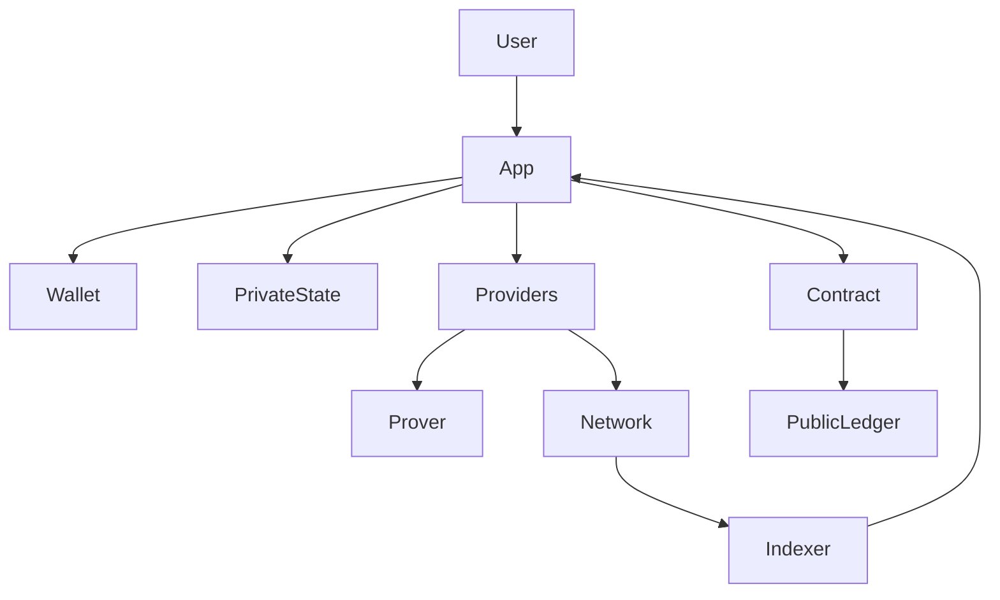
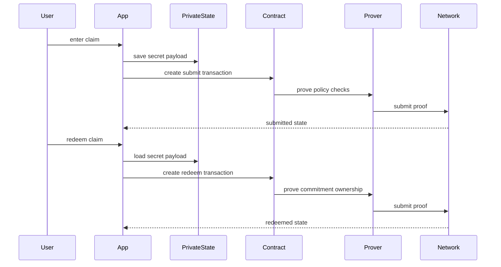
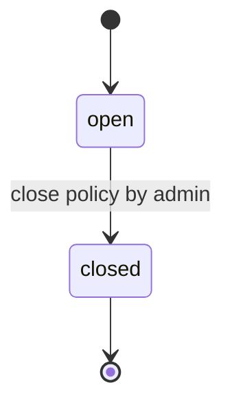
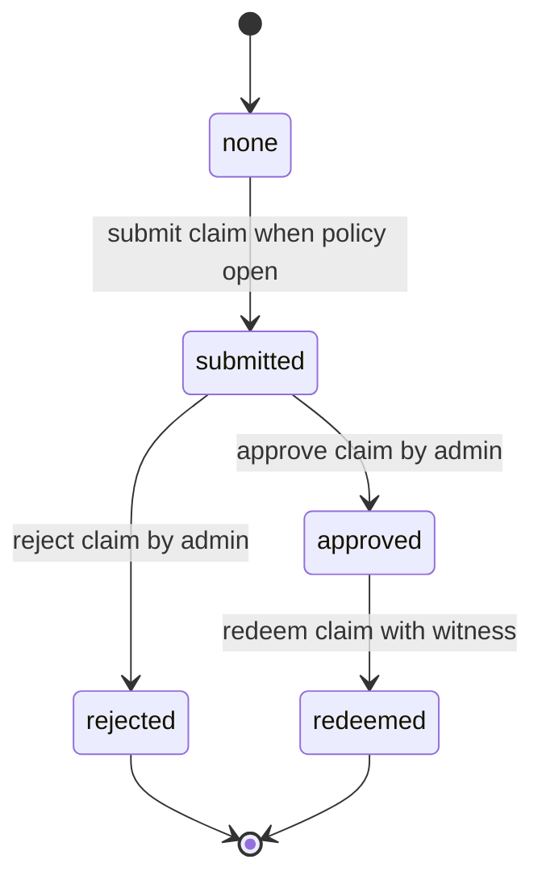
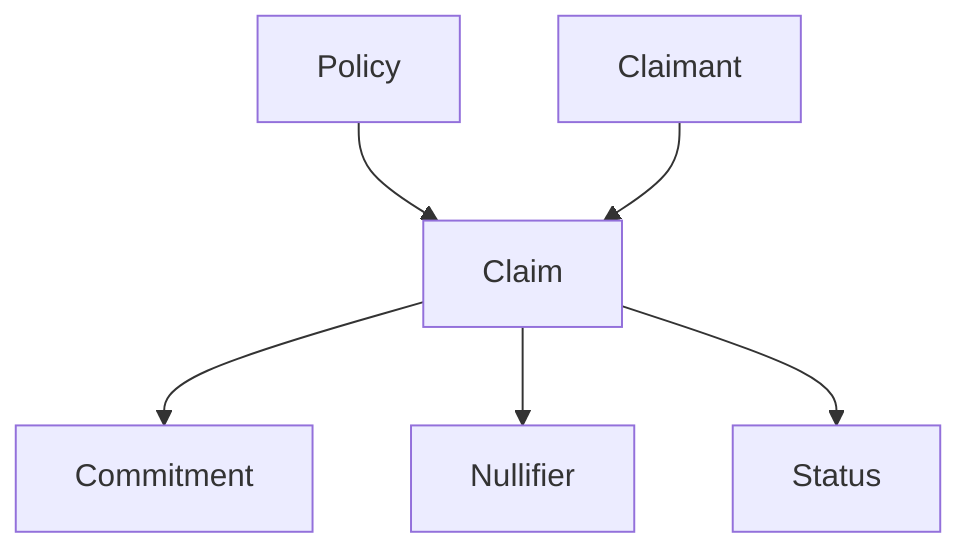

## Overview

ClaimShield は、固定給付ポリシーに対して、1 つの疑似申請者 ID が 1 回だけ行える秘匿申請を扱う。これは実在人物を一意に識別・制限する仕組みではなく、同一 policy contract 内で同じローカル秘密鍵から導出される申請 ID を一度だけ使う MVP である。申請者は支出額、店舗情報、証憑参照、salt をローカル private state に保持し、コントラクトには適格性を満たす commitment、重複防止 nullifier、疑似 ID、状態だけを記録する。管理者は dApp 外の資料確認後に申請を承認または取消し、承認済み申請者は同じ秘密入力を示して一度だけ引換済みにできる。

この設計は既存の Bun workspace と Midnight/Lace 統合を維持しつつ、予測市場の reveal と報酬計算を ClaimShield の非開示状態遷移へ置き換える。設計根拠と調査の詳細は `research.md` に記録する。

### Goals

- 公開 ledger に支出額、店舗、証憑、実ウォレットアドレスを残さずに申請の適格性を検証する。
- 1 contract 1 policy の明確な境界で、提出、審査、取消、引換を一貫して実行する。
- 既存の Lace 接続、6 providers、Indexer 購読、Compact simulator を再利用する。
- README に Dev Container 利用・非利用の再現手順、機能説明、アーキテクチャ図を用意する。

### Non-Goals

- トークン・法定通貨の送付、エスクロー、会計システム連携。
- レシート・個人情報の保存、OCR、暗号化配布、KYC、複数審査者、端末間同期。
- 1 policy contract 内での同一疑似申請者 ID による複数申請、または複数 policy のオンチェーンカタログ。

## Boundary Commitments

### This Spec Owns

- 1 contract 1 policy の公開条件、申請状態、管理者権限、固定給付予定額の集計。
- 秘密 payload に対する範囲検証、commitment の一貫性、同一 policy 内の receipt nullifier の一回利用。
- ブラウザ private state、Lace を経由した証明・送信、公開状態の購読、ClaimShield 画面、README。

### Out of Boundary

- 審査資料の収集・保管・暗号化共有・真偽判定と、送金・資産決済。
- private state の端末間復元、複数申請、issuer が発行する資格証明。

### Allowed Dependencies

- 既存の `pkgs/app/src/contexts`、`lib/wallet.ts`、ネットワーク設定、CLI の Standalone/Preview/PreProd 運用。
- 既存の Compact、Midnight.js 4.0.4、compact-js 2.5.0、compact-runtime 0.15.0、Lace connector、Vitest。
- `pkgs/contract/src/managed/claimshield` と `pkgs/app/public/managed/claimshield` の、Compact ソースから生成された資産。

### Revalidation Triggers

- circuit 名、公開 ledger、commitment/nullifier preimage、private state ID の変更。
- ZK 資産の出力先、ネットワーク設定、Lace transaction bridge、Bun または Compact のバージョン変更。
- 複数申請、資格証明、送金、資料共有を追加する要求。

## Architecture

### Existing Architecture Analysis

既存アプリは `pkgs/contract`、`pkgs/shared`、`pkgs/app`、`pkgs/cli` に分割されている。予測市場の contract/witness/SDK adapter/hook は、秘密状態・公開状態・ウォレット状態の責務をすでに分離している。ClaimShield はこの依存方向を `contract -> shared -> app` として維持し、app は contract の generated binding を直接参照せず shared の型を利用する。

### Architecture Pattern and Boundary Map



- **Selected pattern**: contract-first layered extension。Contract が正当性と状態遷移を所有し、app は入力・private state・可視化を所有する。
- **Dependency direction**: `Compact source -> generated binding -> public ZK assets -> contract exports and shared types -> provider bridge -> SDK adapter -> hook -> UI`。UI は hook だけを呼び、hook は adapter の domain operation だけを呼ぶ。
- **Privacy boundary**: `PublicLedger` は policy 条件、pseudonymous claimant key、commitment、nullifier、status、集計のみ。`PrivateState` は secret key、amount、merchant digest、opaque receipt identifier、evidence digest、salt を保存する。

### Build and Integration Milestones

1. Compact source and witnesses are completed before compilation.
2. Compilation produces the generated binding; contract exports expose that binding to the SDK layer.
3. The build synchronizes generated ZK keys and `zkir` to the matching app public path before an app build or browser proof attempt.
4. Shared types, the provider bridge, SDK adapter, hook, and UI are integrated in that order. A later layer must not introduce its own contract or private-state shape.

The implementation plan treats these milestones as explicit sequential prerequisites. The README and development-environment work are technical reproducibility artifacts because requirements 8.4 and 9.1–9.7 require executable setup and verification guidance.

### Technology Stack

| Layer | Choice / Version | Role in Feature | Notes |
|---|---|---|---|
| Contract | Compact 0.30.0 toolchain | claim state transition and ZK constraints | existing compile flow |
| SDK | Midnight.js 4.0.4 and compact-js 2.5.0 | deploy join call and public state subscription | no new library |
| Frontend | React 19 and Vite | ClaimShield workflow and documentation links | existing app shell |
| Wallet | Lace connector and wallet API | balance prove submit | reuse current v3/v4 bridge |
| Local state | existing private state provider | claimant secret payload storage | scoped by network and contract |
| Tests | Vitest and compact-runtime 0.15.0 | simulator and hook behavior | reuse actor simulator pattern |
| Runtime | Dev Container and Docker Compose | reproducible local network and proof server | align Bun version with root packageManager |

## File Structure Plan

### Directory Structure

```text
pkgs/
├── contract/src/
│   ├── claimshield.compact
│   ├── claimshield-witnesses.ts
│   ├── index.ts
│   ├── managed/claimshield/
│   └── test/claimshield-simulator.ts
├── shared/src/
│   ├── claimshield-types.ts
│   └── index.ts
└── app/src/
    ├── components/ClaimShield/index.tsx
    ├── hooks/useClaimShield.ts
    ├── hooks/useClaimShield.test.ts
    ├── lib/claimshield.ts
    ├── lib/claimshield-providers.ts
    └── i18n/locales/
```

### Modified Files

- `pkgs/contract/src/claimshield.compact` — policy configuration, commitment/nullifier checks, status circuits。
- `pkgs/contract/src/claimshield-witnesses.ts` — typed claimant private payload and witness map。
- `pkgs/contract/src/index.ts` — generated ClaimShield binding and witness exports。
- `pkgs/contract/src/test/claimshield-simulator.ts` — shared ledger and independent actor private contexts。
- `pkgs/contract/src/test/claimshield.test.ts` — contract state, privacy, authority, duplicate and redeem tests。
- `pkgs/shared/src/claimshield-types.ts` — enum, ledger view, provider and contract types。
- `pkgs/shared/src/index.ts` — ClaimShield type re-export。
- `pkgs/app/src/lib/claimshield.ts` — compiled contract, deploy/join, domain calls, public-state subscription。
- `pkgs/app/src/lib/claimshield-providers.ts` — ClaimShield private state scope and ZK asset path。
- `pkgs/app/src/hooks/useClaimShield.ts` — address persistence, subscription, action/error state, personal claim projection。
- `pkgs/app/src/hooks/useClaimShield.test.ts` — hook projection and local-secret-loss behavior。
- `pkgs/app/src/components/ClaimShield/index.tsx` — deploy/join, policy, submit, reviewer and redeem surfaces。
- `pkgs/app/src/App.tsx` and `pkgs/app/src/i18n/locales/en.ts`, `ja.ts` — ClaimShield route and text。
- `package.json` — contract build and ZK asset sync path from `claimshield`。
- `README.md` — overview, feature list, architecture diagram, Dev Container and host setup guides。
- `.devcontainer/devcontainer.json` and `.devcontainer/Dockerfile` — ClaimShield identity and Bun version aligned to root packageManager。

Generated paths under `managed/claimshield` and `public/managed/claimshield` are regenerated by the build; they are never hand-edited.

## System Flows

### Submit and Redeem



### Policy and Claim Lifecycles





`PolicyState` と各 `ClaimStatus` は直交する状態機械である。`close_policy` は policy だけを `closed` にし、新規 `submit_claim` を止める。既存の `submitted` は引き続き審査でき、既存の `approved` は引換できるため、policy を閉じても既存 claim の状態を変更しない。`Rejected` と `Redeemed` は claim の終端状態である。

ポリシーは公開 `startAt` と `endAt` を持ち、コンストラクタで `startAt < endAt` を検証する。Compact に信頼できる時刻オラクルを導入しない MVP では、期間は公開表示・運用上の判断用のメタデータであり、受付をオンチェーンで最終的に止める権限は管理者の `close_policy` にある。UI は端末時刻で期間外の注意を表示しても、それをオンチェーンの権限制御として扱わない。

## Requirements Traceability

| Requirement | Summary | Components | Interfaces | Flows |
|---|---|---|---|---|
| 1.1 | valid policy creation | contract, adapter | `deployPolicy` | policy lifecycle |
| 1.2 | invalid policy rejection | contract, view | `PolicyInput` validation | deploy |
| 1.3 | public policy view | ledger projection, view | `ClaimShieldLedgerState` | policy lifecycle |
| 2.1 | policy close | contract, hook | `closePolicy` | policy lifecycle |
| 2.2 | closed-policy submission rejection | contract | `submit_claim` guard | claim lifecycle |
| 2.3 | administrator authorization | contract | admin witness guard | policy and claim lifecycles |
| 3.1 | private claim input | witnesses, view | `ClaimInput` | submit and redeem |
| 3.2 | private range proof | contract, witnesses | `submit_claim` | submit and redeem |
| 3.3 | out-of-range rejection | contract, hook | `ClaimUiError` | submit |
| 3.4 | personal claim projection | hook, view | private/public projection | submit and redeem |
| 3.5 | local-secret-loss guidance | hook, view | `ClaimUiError` | redeem |
| 4.1 | receipt-use record | contract | nullifier insertion | submit |
| 4.2 | duplicate receipt rejection | contract | nullifier guard | submit |
| 4.3 | policy-scoped receipt use | contract | policy nonce domain separation | submit |
| 5.1 | approval and aggregates | contract, reviewer view | `approveClaim` | claim lifecycle |
| 5.2 | rejection with local reason | reviewer view, contract | `rejectClaim` | claim lifecycle |
| 5.3 | external-review notice | reviewer view | review notice | reviewer flow |
| 5.4 | decided-claim rejection | contract | claim status guard | claim lifecycle |
| 6.1 | approved-claim redemption | contract, witnesses | `redeemClaim` | submit and redeem |
| 6.2 | invalid-redemption rejection | contract | claim status guard | claim lifecycle |
| 6.3 | commitment ownership check | contract, witnesses | `redeem_claim` | submit and redeem |
| 6.4 | no-transfer completion display | view | personal claim projection | redeem |
| 7.1 | minimal public projection | ledger projection, view | `ClaimShieldLedgerState` | UI |
| 7.2 | secret-data exclusion | contract, witnesses | private-state boundary | UI |
| 7.3 | privacy/loss explanation | view, i18n | privacy notice | submit |
| 7.4 | pseudonym limitation | view, README | privacy notice | UI |
| 8.1 | wallet connection gate | existing wallet context, hook | transaction guard | all write flows |
| 8.2 | transaction-stage display | adapter, hook, view | `ClaimTransactionState` | submit and redeem |
| 8.3 | retry-safe error guidance | adapter, hook, view | `ClaimUiError` | all write flows |
| 8.4 | reproducible demo | README, tests | documented scenario | README |
| 9.1 | product and privacy documentation | README | README sections | README architecture |
| 9.2 | feature and demo documentation | README | demo scenario | README |
| 9.3 | architecture diagram | README | Mermaid architecture | README architecture |
| 9.4 | Dev Container guide | README, Dev Container | documented commands | README |
| 9.5 | host-environment guide | README | documented commands | README |
| 9.6 | clean-environment outcomes | README | verification checkpoints | README |
| 9.7 | runtime prerequisites | README, CLI | prerequisite matrix | README |

## Components and Interfaces

| Component | Domain | Intent | Req Coverage | Key Dependencies | Contracts |
|---|---|---|---|---|---|
| ClaimShield Contract | contract | Enforce policy and claim transitions | 1.1–6.4 | Compact runtime P0 | State |
| Claim Witnesses | contract | Provide and persist secret payload | 3.1–3.5, 6.1–6.3 | private state P0 | State |
| ClaimShield Adapter | app | Deploy join call and subscribe | 1.1–8.4 | SDK providers P0 | Service State |
| ClaimShield Hook | app | Own UI operation and personal projection | 2.1–8.4 | adapter P0 | State |
| ClaimShield View | UI | Render policy and role-specific workflows | 1.3, 3.1, 5.3, 7.1–7.4 | hook P0 | State |
| README | docs | Explain feature and reproducible setup | 8.4, 9.1–9.7 | Dev Container P1 | none |

### Contract Layer

#### ClaimShield Contract

| Field | Detail |
|---|---|
| Intent | One policy contract authoritative for claim state and ZK validation |
| Requirements | 1.1–2.3, 3.2–3.3, 4.1–4.3, 5.1–5.4, 6.1–6.4 |

**Responsibilities and Constraints**

- Constructor records sealed `adminKey`, `policyNonce`, label/category encoding, public `startAt`/`endAt`, amount bounds and fixed benefit; it rejects `startAt >= endAt`. Each deployment creates one policy.
- Public ledger records `PolicyState`, `ClaimStatus`, public conditions, `claims`, `commitments`, `usedReceiptNullifiers`, and counters. `ClaimStatus.none` is the default map state.
- `submit_claim` derives `claimantKey` from witness secret, verifies an open policy and one claim per pseudonymous key, validates private amount against public bounds, creates a payload commitment, and inserts a deterministic receipt nullifier. It is not a proof of personhood or Sybil resistance.
- `approve_claim` and `reject_claim` require the derived administrator key. The reviewer UI requires a nonempty reason before it enables `reject_claim`, but that reason is neither a circuit argument nor public/private ClaimShield state; it is deliberately handled through the dApp-external review channel.
- `redeem_claim` recomputes the commitment from witness values and permits only an approved, unredeemed claim to transition to `redeemed`.

**Contracts**: Service [ ] / API [ ] / Event [ ] / Batch [ ] / State [x]

##### State Management

```typescript
type ClaimShieldPrivateState = {
  secretKey: Uint8Array;
  claim: null | {
    amount: bigint;
    merchantDigest: Uint8Array;
    evidenceDigest: Uint8Array;
    opaqueReceiptIdentifier: Uint8Array;
    salt: Uint8Array;
  };
};

type ClaimShieldLedgerState = {
  policyState: PolicyState;
  adminKey: Uint8Array;
  startAt: bigint;
  endAt: bigint;
  minimumAmount: bigint;
  maximumAmount: bigint;
  fixedBenefit: bigint;
  claims: CompactMap<Uint8Array, ClaimStatus>;
  commitments: CompactMap<Uint8Array, Uint8Array>;
  usedReceiptNullifiers: CompactSet<Uint8Array>;
  submittedCount: bigint;
  approvedCount: bigint;
  plannedBenefitTotal: bigint;
};
```

- Preconditions: `startAt < endAt`; opaque receipt identifier is a high-entropy value; payload remains available locally for future redeem.
- Invariants: raw payload values and review reasons never enter the ClaimShield ledger; nullifier excludes salt; policy and claim transitions only follow their respective state diagrams; only admin changes review state.

### Application Layer

#### Claim Witnesses

| Field | Detail |
|---|---|
| Intent | Bridge typed local private state into Compact witness declarations |
| Requirements | 3.1–3.5, 4.1, 6.1–6.3 |

**Dependencies**

- Inbound: ClaimShield adapter — stores validated form input before transaction (P0)
- Outbound: Contract witnesses — exposes secret key and payload values (P0)

**Contracts**: Service [ ] / API [ ] / Event [ ] / Batch [ ] / State [x]

The witness map exposes `local_secret_key`, `get_claim_amount`, `get_merchant_digest`, `get_evidence_digest`, `get_opaque_receipt_identifier`, `get_claim_salt`, and `store_claim`. Witness functions validate presence only; all policy and transition rules remain in Compact.

#### ClaimShield Adapter and Hook

| Field | Detail |
|---|---|
| Intent | Bridge providers and generated contract into a transaction-safe React state model |
| Requirements | 1.1–8.4 |

**Service Interface**

```typescript
type ClaimOperation = "deploy" | "join" | "submit" | "review" | "redeem" | null;

type TransactionStage =
  | "idle"
  | "preparing"
  | "proving"
  | "awaitingSignature"
  | "submitting"
  | "confirming"
  | "succeeded"
  | "failed";

type ClaimTransactionState = {
  operation: ClaimOperation;
  stage: TransactionStage;
  error: ClaimUiError | null;
};

type ClaimUiError =
  | { kind: "input"; code: "invalidPolicyPeriod" | "amountOutOfRange" | "missingReceipt" }
  | { kind: "privateState"; code: "claimPayloadUnavailable" }
  | { kind: "business"; code: "policyClosed" | "duplicateReceipt" | "claimAlreadyDecided" | "claimNotRedeemable" }
  | { kind: "wallet"; code: "walletUnavailable" | "walletRejected" | "networkMismatch" }
  | { kind: "proof"; code: "proofFailed" | "submissionFailed" | "confirmationFailed" };

type ClaimOperationResult = { ok: true } | { ok: false; error: ClaimUiError };

type PolicyInput = {
  label: string;
  category: string;
  startAt: bigint;
  endAt: bigint;
  minimumAmount: bigint;
  maximumAmount: bigint;
  fixedBenefit: bigint;
};

type ClaimInput = {
  amount: bigint;
  merchantDigest: Uint8Array;
  evidenceDigest: Uint8Array;
  opaqueReceiptIdentifier: Uint8Array;
};

interface ClaimShieldOperations {
  deployPolicy(input: PolicyInput): Promise<ClaimOperationResult>;
  joinPolicy(address: string): Promise<ClaimOperationResult>;
  submitClaim(input: ClaimInput): Promise<ClaimOperationResult>;
  approveClaim(claimantKey: Uint8Array): Promise<ClaimOperationResult>;
  rejectClaim(claimantKey: Uint8Array): Promise<ClaimOperationResult>;
  redeemClaim(): Promise<ClaimOperationResult>;
}
```

- The provider factory scopes private state and local contract address by both network and contract address.
- The hook exposes `ClaimTransactionState` and uses it as the single-operation guard: a nonterminal stage prevents duplicate transaction requests and failures expose a discriminated UI error without secret input.
- The adapter calls the current `balanceUnsealedTransaction` and `submitTransaction` bridge; wallet detection and network switching stay in existing contexts.
- Each adapter operation reports `preparing` while it validates/stores local state, `proving` while the transaction/proof is prepared, `awaitingSignature` at the Lace balance/sign step, `submitting` at `submitTransaction`, and `confirming` until the expected public ledger transition arrives through the Indexer subscription. It then reports `succeeded` or `failed`; the view renders every stage.

#### ClaimShield View

The view uses a connected-state join/deploy surface, policy details (including public start/end period), private claim form, personal claim state, and reviewer controls. It displays a persistent public/private explanation before and after submission. Reviewer controls receive only claimant pseudonym, status and aggregate data. Before a rejection, the UI requires a nonempty review-reason field and explains that the reason is intentionally not submitted to or persisted by ClaimShield; the reviewer must deliver or retain it through the dApp-external review process.

### Documentation Layer

#### README and Development Environment

- README contains architecture Mermaid, overview, feature matrix, privacy boundary, demo scenario, Dev Container guide and host guide.
- Both guides use identical build/test/run verification checkpoints and include local Standalone plus testnet prerequisites where relevant.
- Dev Container labels are renamed to ClaimShield and its Bun install is aligned to root `packageManager` and repository guidance. The host guide uses the same version.

## Data Models

### Domain Model



- **Policy**: a deployed contract with rules and an administrator.
- **Claim**: one submission for a pseudonymous claimant key within the policy; it is not a one-person identity guarantee.
- **Commitment**: domain-separated hash of claimant key and private payload.
- **Nullifier**: domain-separated hash of policy nonce and opaque receipt identifier.
- **Status**: `none`, `submitted`, `approved`, `rejected`, or `redeemed`.

### Data Contracts and Integration

The app encodes public fixed-length metadata and policy period fields before circuit calls, validates `startAt < endAt` and form values before private-state persistence, and displays the public policy window. The UI warns from device time when the displayed period has not started or has ended, but this warning never substitutes for the on-chain `PolicyState.open` guard. The UI treats `CompactMap` and `CompactSet` as iterable read-only ledger views. Contract address and private state must never be reused across network contexts; the private-state namespace includes both values.

## Error Handling

| Category | Condition | User response |
|---|---|---|
| Input | amount out of range or missing opaque identifier | show field guidance; do not submit |
| Policy configuration | `startAt >= endAt` | show period validation; do not deploy |
| Private state | secret payload unavailable | explain that redeem is unavailable and show backup guidance |
| Business state | duplicate, closed, already reviewed or redeemed | show the current state and disable repeat action |
| Review | rejection reason is empty | keep reject action disabled; explain that it is handled outside ClaimShield |
| Wallet | unavailable, rejected, or network mismatch | show recovery action without secret values |
| Proof | proof or ZK asset failure | preserve local form data and offer retry |

All write actions pass through the existing wallet-connect gate before preparation starts. The adapter emits no payload values, secret key, salt, evidence digest, opaque receipt identifier, or rejection reason in user-facing errors or browser logs.

## Testing Strategy

- **Contract simulator**: constructor period validation and public period view; range rejection; one claim per pseudonymous key; duplicate nullifier rejection; non-admin review rejection; closed policy rejects only new submissions while submitted claims remain reviewable and approved claims remain redeemable; invalid status transitions; changed payload/salt redeem rejection; redeemed claim cannot redeem again.
- **Privacy assertions**: ledger snapshot, transaction errors, and browser-log seams contain only public policy fields, commitment/nullifier/status/aggregate values and contain no amount, merchant, evidence payload, opaque receipt identifier, secret key, salt, or rejection-reason fields.
- **Hook tests**: wallet-connect gate prevents writes before connection; action guard prevents duplicate transaction request; adapters and provider callbacks advance through proving, signature, submission, and confirmation stages; local-state absence produces recoverable UI state; network/contract-scoped address and state are not mixed; the displayed period produces advisory warnings only; rejection cannot begin until the local review reason is nonempty and that text is never passed to the contract adapter.
- **Build verification**: compile Compact from source, regenerate/sync ZK assets, run contract tests, build the browser app, and run the README path inside and outside Dev Container.

## Security Considerations

- Commitments and nullifiers use separate domain labels; nullifier excludes salt to preserve duplicate detection.
- The demo requires opaque receipt identifiers with sufficient entropy. Real receipt identifiers, issuer signatures and evidence storage are future work.
- Claimant pseudo keys are linkable within one policy but are not wallet addresses, real-world identities, or Sybil resistance; the UI explains this limitation.
- Local state loss prevents redeem by design. Do not add an undocumented recovery path.

## Migration Strategy

The implementation first removes the prediction-market domain implementation while preserving the generic Bun workspace, wallet/network integration, CLI runtime, Dev Container, and shared UI shell. The resulting generic baseline must not retain prediction-market imports, routes, scripts, or public assets. ClaimShield then replaces the empty domain slot: contract source is compiled before generated bindings and ZK assets are copied to the matching public directory.
