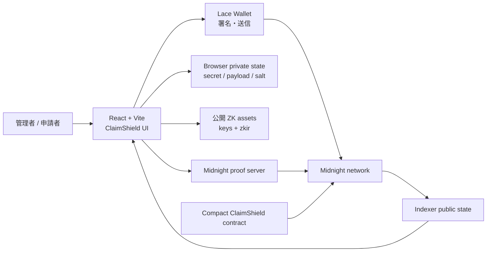

# ClaimShield — Midnight Private Claims dApp

ClaimShield は、福利厚生・経費ポリシーへの申請を、支出額・店舗名・レシート識別子・実ウォレットアドレスを公開せずに記録する Midnight dApp の実装例です。申請者は ZK 証明で金額条件とレシートの一回利用を示し、管理者は dApp 外で資料を確認した後に公開の審査結果だけを記録します。

> このアプリは固定給付の**資格記録**を扱います。トークン、法定通貨、レシート画像、KYC、OCR、端末間の private state 復元は MVP の対象外です。

## このサンプルで確認できること

| 役割 | 機能 | 公開される結果 |
| --- | --- | --- |
| 管理者 | policy の作成・終了、submitted claim の承認／取消 | 条件、状態、件数、集計、疑似申請者 ID |
| 申請者 | 金額範囲を満たす秘密申請、レシート一回利用 | commitment、nullifier、申請状態 |
| 承認済み申請者 | 提出時と同じ private payload による一度だけの引換 | `redeemed` の資格記録 |
| 閲覧者 | 公開 policy と集計の確認 | policy 条件、状態、件数、集計のみ |

### 公開境界

| 公開 ledger / UI | ブラウザの private state のみ |
| --- | --- |
| policy 条件、状態、疑似申請者 ID、commitment、receipt nullifier、件数、集計 | secret key、支出額、店舗 digest、証憑 digest、不透明なレシート識別子、salt |

同じ policy 内の疑似申請者 ID は操作を関連付けられます。これは完全な匿名性、本人性、Sybil 耐性を保証するものではありません。取消理由は管理者が入力を必須にしますが、ClaimShield の contract・adapter・private state には渡さず、dApp 外の運用で扱います。

## アーキテクチャ



生成順序は `Compact source → generated binding → public ZK assets → shared types → provider bridge → adapter → hook → UI` です。`pkgs/contract/src/managed/claimshield` と `pkgs/app/public/managed/claimshield` は生成物なので手編集しません。

## 前提条件

どちらの手順でも次が必要です。

- Git
- Bun **1.2.0**（root の `packageManager` が唯一の基準）
- Compact compiler **0.30.0**
- Docker Engine / Docker Desktop と Docker Compose v2（Standalone または CLI を使う場合）
- ブラウザ版の実操作には、選択 network と一致する Midnight Lace Wallet、同期済みアカウント、十分な DUST

Preview と PreProd では Lace が返す Indexer / WebSocket / prover URI を利用します。Lace の network とアプリの network selector を必ず一致させてください。資金は各ネットワークの faucet から取得します。

- [Preview faucet](https://faucet.preview.midnight.network/)
- [PreProd faucet](https://faucet.preprod.midnight.network/)

秘密鍵・recovery phrase・private payload を `.env`、Issue、ログ、README に保存しないでください。現在の Lace が Ledger-v8 の `balanceUnsealedTransaction` と `submitTransaction` bridge を提供しない場合、ClaimShield は書き込み前に更新を促します。

## Host で起動する

```bash
git clone <your-fork-or-repository-url> midnight-claimshield-sample-app
cd midnight-claimshield-sample-app
bun install --frozen-lockfile
bun run verify:environment
bun run build:app
bun run verify:claimshield-assets
bun run test
bun run test:app
bun run dev -- --host 0.0.0.0
```

期待結果:

- `verify:environment` は Bun 1.2.0、Compact 0.30.0、Docker / Compose を確認する。
- `build:app` は Compact source から binding / ZK asset を生成・同期して Vite production build を完了する。
- `verify:claimshield-assets` は `ClaimShield public ZK assets are synchronized.` を表示する。
- contract と app の Vitest がともに成功し、Vite は `http://localhost:5173/` を表示する。

ブラウザでその URL を開き、右上の network selector を Preview または PreProd に合わせてから Lace を接続します。root 画面の **公開 policy / 秘密申請 / 審査 / 引換** 導線を使ってください。英語 UI の入口文言と導線は右上の `EN` / `JA` で切り替えられます。

## Dev Container で起動する

1. Docker Desktop を起動し、VS Code の Dev Containers 拡張機能でこのリポジトリを **Reopen in Container** します。
2. `postCreateCommand` が `bun install --frozen-lockfile`、Bun version check、Compact 0.30.0 の確認を行うまで待ちます。
3. コンテナ内 terminal で次を実行します。

```bash
bun run verify:environment
bun run build:app
bun run verify:claimshield-assets
bun run test
bun run test:app
bun run dev -- --host 0.0.0.0
```

Dev Container は Vite の `5173` と proof server の `6300` を forward します。`Ports` view の 5173 をブラウザで開き、Preview / PreProd の Lace を接続して画面を確認してください。Docker socket の権限が反映されない場合は container を再起動してから `bun run verify:environment` を再実行します。

Dev Container での期待結果:

- `postCreateCommand` は依存関係を準備し、`verify:environment:container` は Bun 1.2.0 を確認する。続く `compact update 0.30.0` と `compact list` が Compact 0.30.0 を確認する。
- `verify:environment` は Docker socket、Docker Compose、browser 用 Standalone Compose 設定を確認する。
- `build:app` は Compact source から binding / ZK asset を生成・同期して Vite production build を完了する。
- `verify:claimshield-assets` は `ClaimShield public ZK assets are synchronized.` を表示する。`bun run test` と `bun run test:app` はそれぞれ contract と app の Vitest を成功させる。
- `bun run dev -- --host 0.0.0.0` は forwarded port 5173 を表示する。次に Lace を接続し、下記のデモ手順を実行する。

## Standalone と testnet の使い分け

### Preview / PreProd（browser demo の推奨経路）

この経路では Vite と Lace が HTTPS の Indexer / prover を使います。network selector と Lace の network を一致させ、faucet で DUST を入金してから policy 作成などの write を開始します。アプリは接続後の Lace configuration を provider に渡し、public ZK asset は `/managed/claimshield` から取得します。

### Standalone（ローカル infrastructure）

ブラウザ向けの固定ポート環境は次で起動します。

```bash
docker compose -f pkgs/cli/standalone.browser.yml up -d
docker compose -f pkgs/cli/standalone.browser.yml ps
curl --fail http://127.0.0.1:6300/version
bun run dev -- --host 0.0.0.0
```

`proof-server`、`indexer`、`node` が healthy になったことを確認してから、アプリで `Standalone (local)` を選びます。この browser 経路には `undeployed` 用に設定された Lace が必要です。多くの開発者はまず Preview / PreProd を使う方が簡単です。停止時は次を実行します。

```bash
docker compose -f pkgs/cli/standalone.browser.yml down -v
```

`bun run cli standalone` は headless CLI 用の一時 Compose runtime です。ランダムポートを CLI 内だけで使い終了時に停止するため、ブラウザの固定エンドポイントには使いません。

## デモ手順

実ネットワークでは少なくとも管理者、申請者 A、申請者 B の 3 つの Lace account / browser profile を使います。各操作の後は transaction stage が `succeeded` になり、Indexer の公開状態が更新されるまで待ちます。

1. **管理者: policy を作成** — 例として支出額 `500–1500`、固定給付 `300`、未来の開始・終了日時を入力して作成します。公開 dashboard に表示される **public policy contract address** を申請者へ共有します。
2. **申請者 A: 範囲外を確認** — 同じ address を「既存 policy を開く」から開き、`499` を入力して送信します。`amountOutOfRange` に対応する安全な範囲外案内が表示され、circuit は送信されません。
3. **申請者 A: 有効な秘密申請** — `500–1500` の額、店舗名、32 bytes 以上のランダムなレシート識別子を入力します。公開画面には raw amount / merchant / receipt / wallet address が出ず、`submitted`、commitment、nullifier、集計だけが更新されます。
4. **申請者 B: 重複レシート** — A と同じレシート識別子で申請します。同一 policy 内では duplicate receipt として拒否されます。別 policy は独立です。
5. **申請者 B と管理者: 承認と取消** — Step 4 の duplicate 拒否を確認した後、B は新しいランダムなレシート識別子で範囲内の別の秘密申請を送信し、`submitted` になることを確認します。管理者は A の submitted claim を承認すると承認数と固定給付予定総額が増え、B の別の submitted claim を取り消せます。取消前に理由を入力しますが、その文字列は ClaimShield に送信・保存されません。
6. **申請者 A: 一回限りの引換** — approved かつ同じ browser private state がある申請だけが引換できます。成功後は `redeemed` となり、再実行は拒否されます。資産送付は行いません。

private state を失うと詳細確認と引換はできません。画面が表示する recovery guidance のとおり、利用者自身のバックアップから復元する必要があります。

## 検証コマンド一覧

```bash
# Compact → generated binding → public ZK assets → app production build
bun run build:app

# generated ZK asset の一致確認
bun run verify:claimshield-assets

# contract simulator
bun run test

# app hook / adapter / UI tests
bun run test:app

# 全 workspace の型検査・build
bun run typecheck
```

クリーン環境での実行記録は、[Dev Container](docs/verification/devcontainer-2026-07-26.md) と [host](docs/verification/host-2026-07-26.md) のそれぞれに残します。
